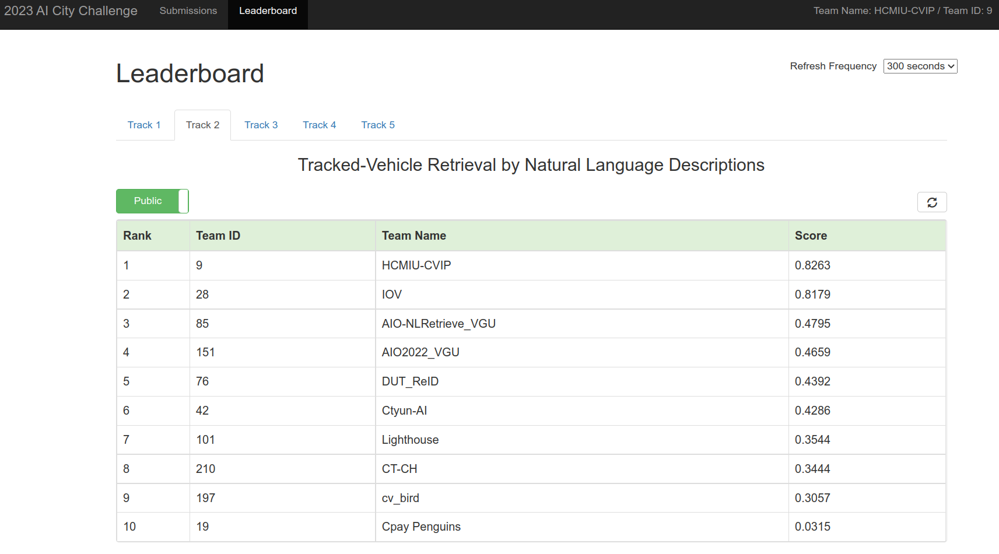
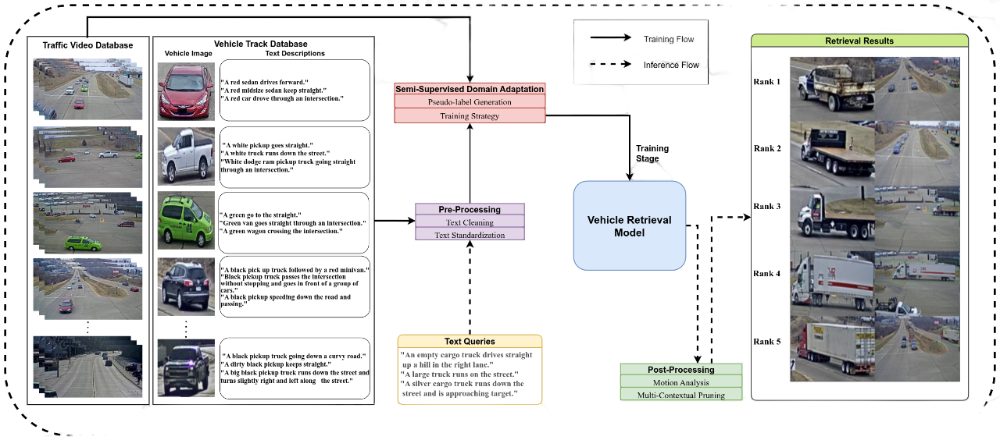

# [[CVPRW] 2023 AI City Challenge:](https://www.aicitychallenge.org/) Tracked-Vehicle Retrieval by Natural Language Descriptions With Multi-Contextual Adaptive Knowledge

🏆 The 1st Place Solution to The 7th NVIDIA AI City Challenge (2023) Track 2: Tracked-Vehicle Retrieval by Natural Language Descriptions.

\[[official results](https://www.aicitychallenge.org/2023-challenge-winners/)\] \[[paper](https://openaccess.thecvf.com/content/CVPR2023W/AICity/html/Le_Tracked-Vehicle_Retrieval_by_Natural_Language_Descriptions_With_Multi-Contextual_Adaptive_Knowledge_CVPRW_2023_paper.html)\] \[[slides](https://drive.google.com/file/d/1OCXMHFtjRFZMvEWG6PAoxFGiBhPfr0N_/view?usp=sharing)\]



# Framework



The configuration files are in `src/configs.py`. Set up the right data path first:
`DATA_DIR` - path to store dataset folder (extracted frames)

`ROOT_DIR` - path to source code folder

## Pre-Processing

Download the model checkpoints for `srl` in folder `pre_process`[here](https://drive.google.com/drive/folders/1CivhsX0xGxRda9EkZ6uqM_CMaJV40KMO?usp=share_link) and place it in folder `src/pre_process/weight/`

```
1. bash scripts/prepare_pre_process.sh
2. bash scripts/pre_process.sh
```

## Training

```
bash scripts/train.sh
```

## Inference

Change the `INFERENCE_FROM` in your configuration file to the checkpoints downloaded in folder `recognition` and `retrieval` [here](https://drive.google.com/drive/folders/1CivhsX0xGxRda9EkZ6uqM_CMaJV40KMO?usp=share_link), and run the below bash scripts to extract embeddings and ranking the query videos.

```
bash scripts/inference.sh
```

## Post-Processing & Submission

```
bash scripts/post_process.sh
```

## Others

If you have any questions, please leave an issue or contact us: lehuy2316@gmail.com.

```
@InProceedings{Le_2023_CVPR,
    author    = {Le, Huy Dinh-Anh and Nguyen, Quang Qui-Vinh and Luu, Duc Trung and Chau, Truc Thi-Thanh and Chung, Nhat Minh and Ha, Synh Viet-Uyen},
    title     = {Tracked-Vehicle Retrieval by Natural Language Descriptions With Multi-Contextual Adaptive Knowledge},
    booktitle = {Proceedings of the IEEE/CVF Conference on Computer Vision and Pattern Recognition (CVPR) Workshops},
    month     = {June},
    year      = {2023},
}
```
